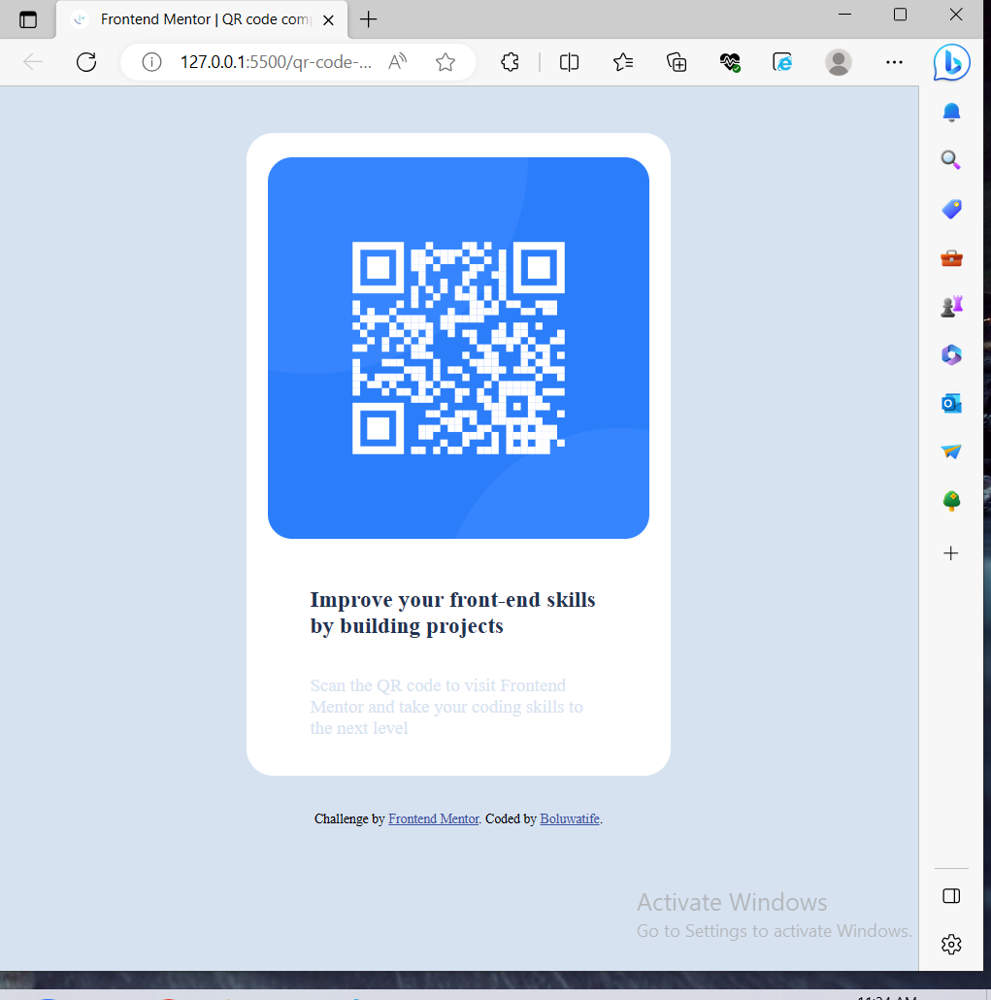

# Frontend Mentor - QR code component solution

This is a solution to the [QR code component challenge on Frontend Mentor](https://www.frontendmentor.io/challenges/qr-code-component-iux_sIO_H). Frontend Mentor challenges help you improve your coding skills by building realistic projects. 

## Table of contents

- [Overview](#overview)
  - [Screenshot](#screenshot)
  - [Links](#links)
- [My process](#my-process)
  - [Built with](#built-with)
  - [What I learned](#what-i-learned)
  - [Continued development](#continued-development)
  - [Useful resources](#useful-resources)
- [Author](#author)
- [Acknowledgments](#acknowledgments)

**Note: Delete this note and update the table of contents based on what sections you keep.**

## Overview
I tried building a QR code component

**

### Screenshot




### Links

- Solution URL: [Add solution URL here](https://your-solution-url.com)
- Live Site URL: [Add live site URL here](https://your-live-site-url.com)

**

## My process

### Built with

- Semantic HTML5 markup
- CSS custom properties
- Flexbox

**


### What I learned

Use this section to recap over some of your major learnings while working through this project. Writing these out and providing code samples of areas you want to highlight is a great way to reinforce your own knowledge.

I learned how to use flexbox.

**


```css
body {
        
        display: flex;
        flex-direction: column;
        justify-content: center;
        align-items: center;
      }

      .main-container {
        display: flex;
        flex-direction: column;
        justify-content: center;
        align-items: center;
        
      }

```


**

### Continued development


I want to continue focusing on and growing my css skills. It was an easy task but i struggled a bit with some CSS concepts like Flexbox and how to center a div, lol but I leveraged the power of google to help me when I was stuck. I would love to further strengthen my knowledge on the use of CSS Flexbox and Grid.

**


### Useful resources

- [Example resource 1](https://www.tutorialspoint.com) - This helped me for Flexbox. 
- [Example resource 2](https://www.w3schools.com) - This also helped me with Flexbox.

**

## Author


- Frontend Mentor - [@yourusername](https://www.frontendmentor.io/profile/teefeh07)
- Twitter - [@yourusername](https://www.twitter.com/__Bioluwatife)


**
